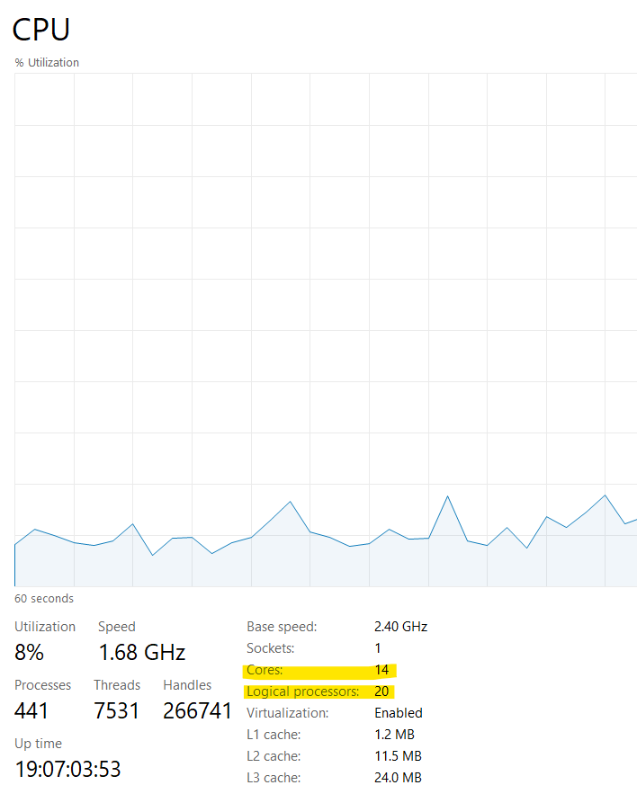

# Tema practica
### Echipa: Carausu Ana-Madalina, Haiura Andreea Isabela, Petrea Daniela

## Evaluarea implementarii
Pentru implementare am folosit **Java**. Tipul de paralelizare pe care l-am ales este utilizarea **thread-urilor**. Factorul de paralelism este dat de numarul de thread-uri utilizate.

In cazul **publicatiilor**, implementarea permite rularea folosind orice numar de thread-uri(chiar si 1, pentru cazul fara paralelizare), setat in prealabil in fisierul ```ConstantsPublications.java```.

In cazul **subscriptiilor**, putem rula codul fara a folosi paralelizare, folosind apelul metodei ```generateSubscriptions(useThreads=false)``` sau cu paralelizare, cu apelul ```generateSubscriptions(useThreads=true)```, caz in care se vor folosi intotdeauna 5 thread-uri. Thread-urile au fost folosite astfel: initial am completat fiecare subscriptie cu cate un camp din toate cele pe care trebuia sa le folosim si am contorizat acest aspect. Apoi, am alocat cate un thread pentru fiecare camp(*company, value, drop, variation, date*), indiferent daca mai exista sau nu elemente din acel camp care trebuie adaugate in subscriptii. Fiecare thread este responsabil de adaugarea in subscriptii a tuturor aparitiilor necesare ale unui camp.

### Evaluarea timpilor obtinuti la rulare
| Nr. publicatii | Nr. thread-uri | Timp rulare (ms) |
| :----|:---:|----:|
| 100  | 1 | 71 |
| 100  | 4 | 129 |
| 100  | 10 | 171 |
| 1000000  | 1 | 1129 |
| 1000000  | 4 | 649 |
| 1000000  | 10 | 731 |
| 5000000  | 1 | 3571 |
| 5000000  | 4 | 2237 |
| 5000000  | 10 | 2619|

| Nr. subscriptii | Nr. thread-uri | Timp rulare (ms) |
| :--- |:----: |-----:|
| 100  | 1 |  63 |
| 100  | 5 |  67 |
| 1000000  | 1 | 833 |
| 1000000  | 5 | 766 |
| 5000000  | 1 | 2875 |
| 5000000  | 5 | 2703 |

**Obs:** Pentru generarea unui numar mic de publicatii/subscriptii, timpul de rulare creste daca folosim mai multe thread-uri (in loc sa scada) deoarece in Java, crearea și administrarea thread-urilor implică un anumit cost suplimentar. Dacă operația pe care o realizam este destul de simplă sau nu implică o cantitate mare de calcule, atunci costul de a crea și gestiona thread-urile poate depăși beneficiile paralelizării.
**Specificatiile procesorului pe care s-au rulat testele:**


